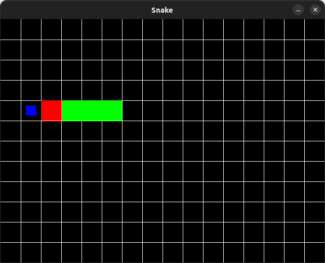

# SDL_Snake
A Simple Snake Clone Made Using SDL2 and C++
  
## What I Learned
* Simple geometry rendering using [SDL2](https://www.libsdl.org/)
* How to cap game frame rate
* General C++ Skills ([STL Library](https://en.wikipedia.org/wiki/Standard_Template_Library), Basic Object Oriented Programming using C++, How to structure files into header (.hpp) and implementation files (.cpp)
  
## ScreenShots

  

  

  

  

  
